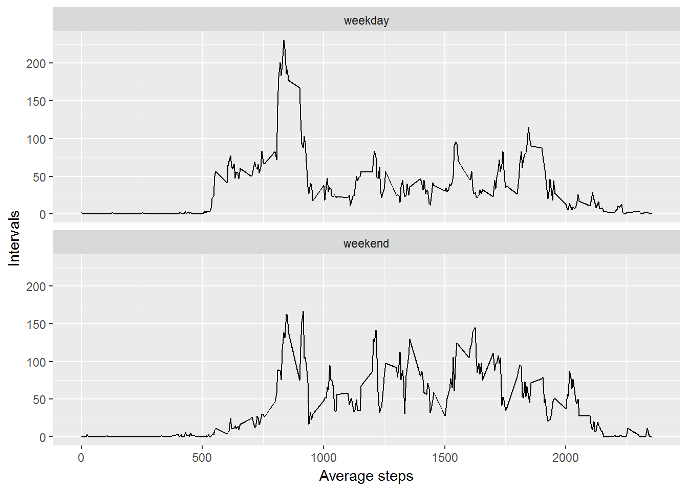

This document was produced using R Studio Version 1.0.44 

##Loading and preprocessing the data

### 1. Loading the data (i.e. read.csv())


```r
#Creating the directory to process the data
if(!file.exists("data")) { dir.create("data")}

#Downloading and unziping the data
fileUrl <- "https://d396qusza40orc.cloudfront.net/repdata%2Fdata%2Factivity.zip"

if(!file.exists("./data/original.zip")) 
{download.file(fileUrl,destfile="./data/original.zip")
    unzip("./data/original.zip",exdir = "./data") 
}
rm(fileUrl)

#Reading the data
activity <- read.csv(file="./data/activity.csv",header = TRUE)
```

### 2.Processing/transforming the data (if necessary) into a format suitable for the analysis

```r
#Finding out the column types
str(activity)
```

```
## 'data.frame':	17568 obs. of  3 variables:
##  $ steps   : int  NA NA NA NA NA NA NA NA NA NA ...
##  $ date    : Factor w/ 61 levels "2012-10-01","2012-10-02",..: 1 1 1 1 1 1 1 1 1 1 ...
##  $ interval: int  0 5 10 15 20 25 30 35 40 45 ...
```

```r
#Converting the date from factor to date format
activity$date <- as.Date(activity$date,"%Y-%m-%d")

#Checking the result
str(activity)
```

```
## 'data.frame':	17568 obs. of  3 variables:
##  $ steps   : int  NA NA NA NA NA NA NA NA NA NA ...
##  $ date    : Date, format: "2012-10-01" "2012-10-01" ...
##  $ interval: int  0 5 10 15 20 25 30 35 40 45 ...
```

##What is mean total number of steps taken per day?
For this part of the assignment, the missing values in the dataset were ignored.


```r
#Creating a data set without NAs
activity_noNA <- activity[complete.cases(activity),]
```

### 1. Calculating the total number of steps taken per day


```r
stepsperday <- tapply(activity_noNA$steps,activity_noNA$date,FUN=sum)
stepsperday_df <- data.frame(day = names(stepsperday), steps = stepsperday)

head(stepsperday_df)
```

```
##                   day steps
## 2012-10-02 2012-10-02   126
## 2012-10-03 2012-10-03 11352
## 2012-10-04 2012-10-04 12116
## 2012-10-05 2012-10-05 13294
## 2012-10-06 2012-10-06 15420
## 2012-10-07 2012-10-07 11015
```

### 2. [Difference between a Histogram and a Bar Plot](http://stattrek.com/statistics/charts/histogram.aspx?Tutorial=AP).Making a histogram of the total number of steps taken each day


```r
hist(stepsperday_df$steps,
     main="Histogram of total number of steps taken each day",
     xlab="",
     col = "skyblue")
```


### 3. Calculating and reporting the mean and median of the total number of steps taken per day


```r
#Calculating the mean and medians
```

```r
#Mean
noNA_mean <- mean(stepsperday_df$steps)
noNA_mean
```

```
## [1] 10766.19
```

```r
#Median
noNA_median <- median(stepsperday_df$steps)
noNA_median
```

```
## [1] 10765
```

The mean is **10766** and the median is **10765**.

## What is the average daily activity pattern?

### 1. Making a time series plot (i.e. type = "l") of the 5-minute interval (x-axis) and the average number of steps taken, averaged across all days (y-axis)


```r
#Getting the amount of steps per each interval
stepsperinterval <- tapply(activity_noNA$steps,activity_noNA$interval,FUN=mean)
stepsperinterval_df <- data.frame(interval = names(stepsperinterval), 
                                  meanstepsint = stepsperinterval)


#Converting the intervals to a time variable
stepsperinterval_df$interval <- as.numeric(
    as.character(
        stepsperinterval_df$interval))

stepsperinterval_df$interval2 <- strptime(
    sprintf("%04d",stepsperinterval_df$interval),format="%H%M")

#Ploting the graph
with(stepsperinterval_df,plot(interval2,meanstepsint, type="l", 
                              xlab= "Intervals", ylab="Average Steps",
                              main = "Average steps per interval."))
```


### 2. Determining Which 5-minute interval, on average across all the days in the dataset, contains the maximum number of steps.


```r
interval <- subset(stepsperinterval_df,
                   meanstepsint==max(stepsperinterval_df$meanstepsint))$interval
as.character(interval)
```

```
## [1] "835"
```


## Imputing missing values

There are a number of days/intervals where there are missing values (coded as NA). 
The presence of missing days may introduce bias into some calculations or summaries of the data.

### 1. Calculating and reporting the total number of missing values in the dataset (i.e. the total number of rows with NAs)


```r
sumNA <- sum(is.na(activity$steps))
sumNA
```

```
## [1] 2304
```

The total number of missing values in the dataset is **2304**.

### 2. Devising a strategy for filling in all of the missing values in the dataset.

The selected strategy will be that all missing values will be fill by the mean
for that interval across all the days. This was calculated above.

Here is a sneak peak of this data:


```r
head(stepsperinterval_df)
```

```
##    interval meanstepsint           interval2
## 0         0    1.7169811 2016-12-30 00:00:00
## 5         5    0.3396226 2016-12-30 00:05:00
## 10       10    0.1320755 2016-12-30 00:10:00
## 15       15    0.1509434 2016-12-30 00:15:00
## 20       20    0.0754717 2016-12-30 00:20:00
## 25       25    2.0943396 2016-12-30 00:25:00
```

### 3. Creating a new dataset that is equal to the original dataset but with the missing data filled in.


```r
#Filling the NA Information
library(plyr)
activity2 <- join(x=activity,y=stepsperinterval_df,by="interval")

for(i in 1:nrow(activity2)){
    if(is.na(activity2[i,"steps"])){
        activity2[i,"steps"] = activity2[i,"meanstepsint"]
    }
}
#Creating the dataset
activity2 <- activity2[,1:3]
```

### 4. Making a histogram of the total number of steps taken each day and Calculating and report the mean and median total number of steps taken per day.


```r
#mean and median steps per day
stepsperday_df$meansteps <- tapply(activity_noNA$steps,activity_noNA$date,FUN=mean)
stepsperday_df$mediansteps <- tapply(activity_noNA$steps,activity_noNA$date,FUN=median)

#Total Mean
all_mean <- mean(stepsperday_df$steps)
all_mean
```

```
## [1] 10766.19
```

```r
#Total Median
all_median <- median(stepsperday_df$steps)
all_median
```

```
## [1] 10765
```

So we have that the mean without NAs is **10766** and the median is **10765**.
The mean with the missing values filled is **10766** and the median is **10765**.

**Answering the questions:**

1. **Do these values differ from the estimates from the first part of the assignment?** No, both values are very similar.

2. **What is the impact of imputing missing data on the estimates of the total daily number of steps?** It seens to be a very minimal or no impact.

##Are there differences in activity patterns between weekdays and weekends?
The dataset with the filled-in missing values will be used.

### 1. Creating a new factor variable in the dataset with two levels - "weekday" and "weekend" indicating whether a given date is a weekday or weekend day.


```r
activity2$dayofweek <- ""

for(i in 1:nrow(activity2)){
    if(weekdays(activity2[i,"date"]) %in% c("Sunday","Saturday")){
        activity2[i,"dayofweek"] = "weekend"
    } else {
        activity2[i,"dayofweek"] = "weekday"
    }
}

activity2$dayofweek <- as.factor(activity2$dayofweek)
```

### 2. Making a panel plot containing a time series plot (i.e. type = "l") of the 5-minute interval (x-axis) and the average number of steps taken, averaged across all weekday days or weekend days (y-axis). 

```r
#Getting the data for the plot
weekday <- subset(activity2,activity2$dayofweek=="weekday")
weekend <- subset(activity2,activity2$dayofweek=="weekend")

spi_weekday <- tapply(weekday$steps,weekday$interval,FUN=mean)
spi_weekend <- tapply(weekend$steps,weekend$interval,FUN=mean)

spi_weekday_df <- data.frame(interval = names(spi_weekday), 
                                  meanstepsint = spi_weekday,
                            dayofweek = as.factor("weekday"))
spi_weekend_df <- data.frame(interval = names(spi_weekend), 
                             meanstepsint = spi_weekend,
                             dayofweek = as.factor("weekend"))

spi <- rbind(spi_weekday_df,spi_weekend_df)

#plot
library(ggplot2)

spi$interval <- as.numeric(
    as.character(
        spi$interval))

spi$interval2 <- strptime(
    sprintf("%04d",spi$interval),format="%H%M")


qplot(x = interval,y=meanstepsint, data=spi, geom = "line", 
      xlab = "Average steps", ylab="Intervals") +
    facet_wrap(~ dayofweek, ncol = 1)
```



